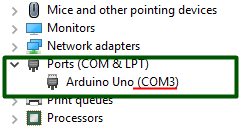

# How to use an Arduino Uno board as an ISP (in-system programmer) to burn an AVR

### Step 1: 
Download [Arduino IDE](https://www.arduino.cc/en/Main/Software) and install.

_Note: I recommend not to use Windows app as I have found problems on version 1.8.1. For a Windows platform, please use Windows installer._

### Step 2:
Now we will find the port name that our Arduino board is connected.

On a windows platform, open __Device Manager__. Now plug in your arduino board via a USB cable. Now you can see the newly added device under __Ports__. In my case it is __COM3__.

### Step 3:
On Arduino IDE, select:

File -> Examples -> 11.ArduinoISP -> ArduinoISP

Tools -> Board -> Arduino/Genuino Uno

Tools -> Port -> COM3

Click 'Verify'

Click 'Upload'

### Step 4:
Check the datasheet of the microcontroller that you are going to burn. In my case I will burn the hex file into an Atmega328p-pu microcontroller. And here is the pinout of this microcontroller:

Now I will use wires to connect this microcontroller to my arduino uno board.

The pins necessary for this setup are: __RESET, VCC, GND, MOSI, MISO and SCK__. 

#### Connection Diagram:
Arduino Uno pin 13 --> AVR pin SCK

Arduino Uno pin 12 --> AVR pin MISO

Arduino Uno pin 11 --> AVR pin MOSI

Arduino Uno pin 10 --> AVR pin RESET

Arduino Uno pin 5V --> AVR pin VCC

Arduino Uno pin GND --> AVR pin GND

##### For my Atmega328p-pu, the connections are:

Arduino Uno pin 13 --> Atmega328p-pu pin SCK (pin 19/PB5)

Arduino Uno pin 12 --> Atmega328p-pu pin MISO (pin 18/PB4)

Arduino Uno pin 11 --> Atmega328p-pu pin MOSI (pin 17/PB3)

Arduino Uno pin 10 --> Atmega328p-pu pin RESET (pin 1/PC6)

Arduino Uno pin 5V --> Atmega328p-pu pin VCC (pin 7)

Arduino Uno pin GND --> Atmega328p-pu pin GND (pin 8)

And between Atmega328p-pu RESET and GND pins, we will add a 10uF capacitor.

Our whole setup is done. Now you can burn your hex file into the microcontroller (in my case Atmega328p-pu) using the arduino uno. You can use Arduino IDE or linux terminal to burn the hex files. I personally feel more comfortable with linux terminal. Here I've included a [__Makefile__](Makefile) which you can use to burn your microcontrollers using arduino uno. Please pay attention to lines 7,8 and 10 of the Makefile to function it properly for your own setup.

_Don't know how to configure your linux OS for burning an AVR microcontroller? Check my [next project](../../../tree/master/002. Setup Environment on Linux OS for AVRdude).
