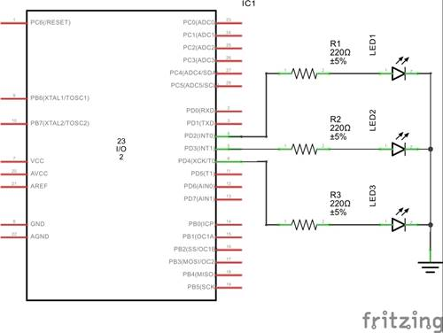
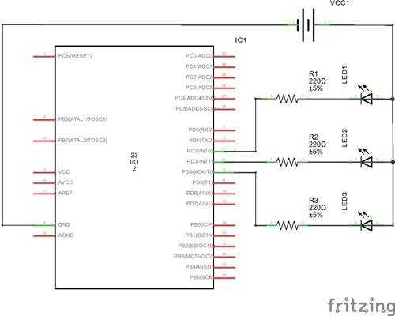

## Project Description

It is a very basic microcontroller project. We will first draw a circuit which includes a microcontroller, 3 LEDs (red, yellow and green),
3 resistors to limit the current. Then we will write a simple program to design a traffic light system.

Here is the schematic which I used to design the traffic light system. I used pins PD2, PD3 and PD4 of an Atmega8 microcontroller in this setup.
I also used an MKII board which has an in-built ISP to burn the hex file into the microcontroller. My external clock is set at 3.6864 MHz.
You can use an Arduino Uno as an ISP to burn your microcontroller if you don't have any setup like mine.

### Solution

We can have multiple schematics and can have different approach to write an smart program for this simple task. I will use C programming language.
You should use your own preferred programming language and coding style.

__In this project time between Red and Yellow, Yellow and Green and Green and Red is 1 second. You can set your own time in your code.__ 

#### Schematic 1 (Common Cathode)

#### Schematic 2 (Common Anode)

#### Final Output [External link](https://vimeo.com/203683124)
