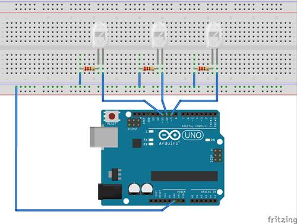

# Project Description

Here we will first use a bare AVR micro-controller to design a Traffic Light system. To flush the micro-controller
you can use an Arduino Uno as an ISP. I have used an MK2 board that comes with an in-built ISP to burn the hex file into the microcontroller. On my MK2 board, the external clock is set at 3.6864 MHz. For your setup the clock might be different. So please
edit lines 7 and 8 of the [Makefile](https://github.com/piLinux/funWare/blob/master/003.%20Traffic%20Light/Makefile)
before programming your own micro-controller.

We will try to write different programs to develop the same Traffic Light system with the AVR micro-controller. And later we will
write program for an Arduino Uno.

## Atmega8 Project

I have used pins PD2, PD3 and PD4 of an Atmega8 microcontroller in this setup.

### Solution

We can draw multiple schematics and can write program in different ways to solve this simple task. I will use C programming language.
You should use your own preferred programming language and coding style.

__For this project I have chosen 1 second time delay. You should set your own time delay in your code.__ 

#### Schematic 1 (Common Cathode)

[Solution 1](Schematic1_Solution1.c) | [Solution 2](Schematic1_Solution2.c) | [Solution 3](Schematic1_Solution3.c) | [Solution 4](Schematic1_Solution4.c)

#### Schematic 2 (Common Anode)

[Solution 1](Schematic2_Solution1.c) | [Solution 2](Schematic2_Solution2.c) | [Solution 3](Schematic2_Solution3.c) | [Solution 4](Schematic2_Solution4.c)

## Arduino Project

#### Wiring

Arduino Uno pin 9 -> red LED
Arduino Uno pin 10 -> yellow LED
Arduino Uno pin 11 -> green LED

[Arduino Sketch](ArduinoUnoProject.ino)

#### Final Output:    [External link](https://vimeo.com/205972612)
