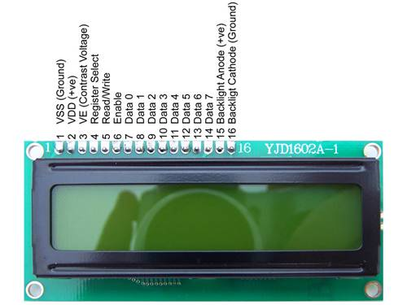
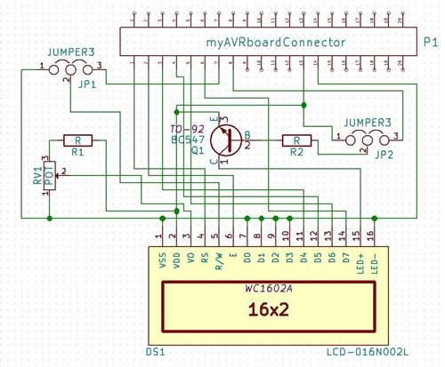

Hitachi HD44780 compatible LCDs are the standard ones used very often. Here we will discuss about the LCDs that have 16x2 characters.

## Pinouts

For any HD44780 compatible LCD, the pinouts are:

| Pin 1 | Pin 2 | Pin 3 | Pin 4 | Pin 5 | Pin 6 | Pin 7 | Pin 8 | Pin 9 | Pin 10 | Pin 11 | Pin 12 | Pin 13 | Pin 14 | Pin 15 | Pin 16 |
| ----- | ----- | ----- | ----- | ----- | ----- | ----- | ----- | ----- | ------ | ------ | ------ | ------ | ------ | ------ | ------ |
| VSS (GND) | VDD (+5V) | VE | RS | R/W | E | D0 | D1 | D2 | D3 | D4 | D5 | D6 | D7 | LED+ | LED- |

[Here](http://www.protostack.com/led-lcd/lcd-modules/16-x-2-character-lcd-module-with-yellow-green-backlight) is an example of a 16 x 2 
character LCD module with yellow/green backlight. It uses an ST7065C controller, which is HD44780 compatible.
And the pinouts are (taken from protostack.com):

For explanation and usage of these pins, please check this nice tutorial on 
[avrbeginners.net](http://www.avrbeginners.net/interfacing/44780_lcd/8bit_1.html).

# Connecting to an AVR

## Option 1 (MK2 board and LCD add-on from myAVR)

We can use an LCD add-on from [myAVR](http://shop.myavr.de/Add-Ons%20und%20Module/myAVR%20LCD%20Add-On.htm?sp=article.sp.php&artID=15) with
an [MK2 board](http://shop.myavr.de/index.php?sp=article.sp.php&artID=40) and start programming our micro-controller right away.

For your curious mind, here is the explanation of the circuit design which is used for the myAVR LCD add-on. Later when we are going to
use our own arduino board or an avr micro-controller with an LCD display (like the one from 
[protostack.com](http://www.protostack.com/led-lcd/lcd-modules/16-x-2-character-lcd-module-with-yellow-green-backlight)), we will use
the similar circuit diagram to setup the arrangement on a solderless breadboard.

For a better view, [click here.](myAVR-LCD_addon_large.jpg)

On this board, a Displaytech 162A LCD is used (on my schematic design, DS1 represents this LCD) which is a 16x2 Liquid Crystal Display
with background illumination and it has a Hitachi HD44780 controller. Beside the LCD, the following parts are required to complete this
design:

1. One 10K pot for the contrast (VE)
2. 16 pin Male 0.01 Headers
3. One NPN transistor
4. Two jumpers
5. Two 10-Ohm resistors
6. Two myAVR connectors (one having 20 male pins and another one having 20 female pins) for interfacing with the myAVR MK2 baord
_(in next revision, I'll add more details about myAVR connectors for MK2 board and LCD add-on)_

### Wiring (Please compare the description with the schematic for better understanding)

1. JP1 pin (1) + POT pin (1) + LCD pins (1+7+8+9+10+16) + myAVR connector pin (14)
2. LCD pin (2) + R1 + POT pin (3)
3. LCD pin (2) + myAVR connector pin (13) + JP2 pin (1)
4. LCD pin (2) + Transistor (Emitter)
5. Transistor (Base) + R2 + J2 pin (2)
6. JP2 pin (3) + myAVR connector pin (8)
7. LCD pin (3) + POT pin (2)
8. LCD pin (4) + myAVR connector pin (1)
9. LCD pin (5) + JP1 pin (2)
10. LCD pin (6) + myAVR connector pin (2)
11. LCD pin (11) + myAVR connector pin (3)
12. LCD pin (12) + myAVR connector pin (4)
13. LCD pin (13) + myAVR connector pin (5)
14. LCD pin (14) + myAVR connector pin (6)
15. LCD pin (15) + Transistor (Collector)

## Option 2 (connect a HD44780 compatible LCD using breadboard)

The principle is same just like the previous circuit diagram that I have explained. Here instead of using those 20-pin myAVR connectors,
we will wire the pins directly with the AVR micro-controller pins using a solderless breadboard.

For interfacing with an arduino uno board, there is an amazing tutorial on 
[instructables.com](http://www.instructables.com/id/Step-By-Step-LCD-wiring-4-Bit-Mode-and-Programmi/?ALLSTEPS).
Since it covers all the steps very clearly, I am not repeating them here again.
